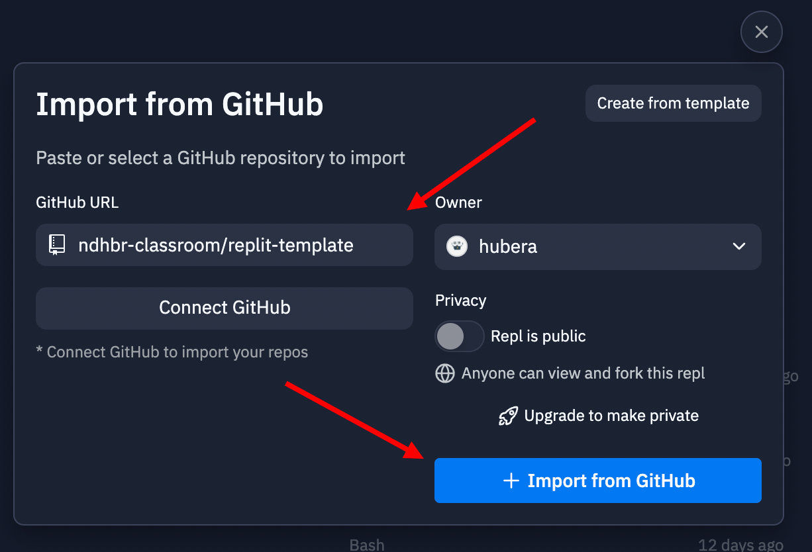
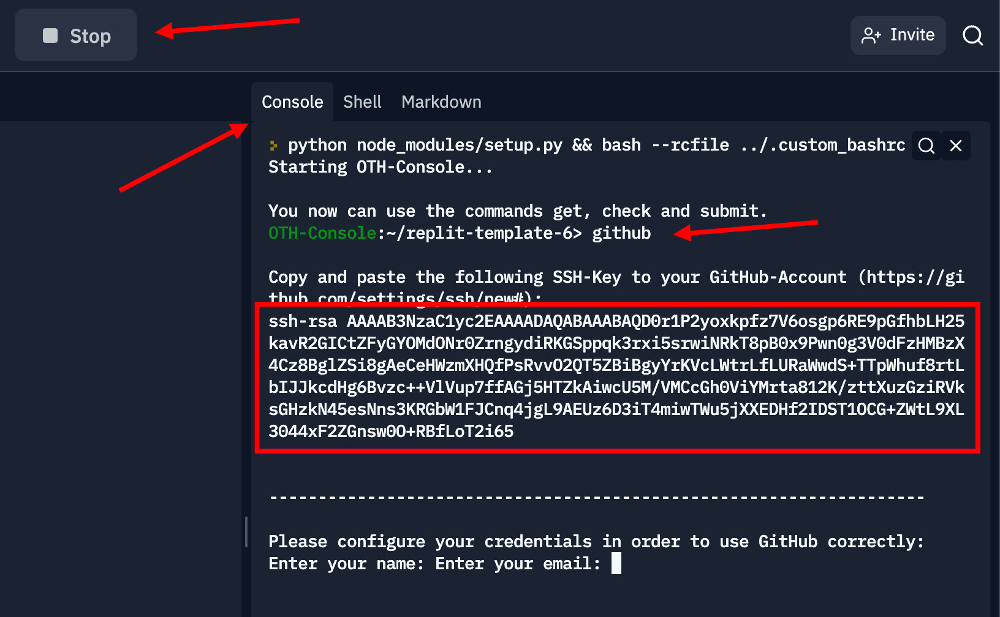

# Willkommen
Hey! Du willst programmieren lernen? Dann bist du hier genau richtig. Hier wirst du Schritt für Schritt zu deinem ersten selbstprogrammierten Programm hingeführt.

---

## Aufgaben
Eine Anleitung, wie du Aufgaben bearbeitest, findest du unten.

### Aufgabe 1: Intro
Hier geht's los. In dieser Aufgabe wirst du deine ersten Erfahrungen mit der Programmiersprache Python machen.
>Teilnahmelink: [01 Intro](https://classroom.github.com/a/NhB7RLNP)

### Aufgabe 2: Erste Schleife
In der zweiten Aufgabe lernst du die erste Art von Schleifen.
>Teilnahmelink: [02 Erste Schleife](https://classroom.github.com/a/ltFInNl6)

### Aufgabe 3: Mario
Gegen Ende von Welt 1-1 in Nintendos Super Mario Brothers muss Mario eine rechts ausgerichtete Pyramide aus Blöcken erklimmen. Deine Aufgabe ist es diese Pyramide nachzubauen.
>Teilnahmelink: [03 Mario](https://classroom.github.com/a/eknnWrje)

---

## Voraussetzungen
- GitHub Account ([github.com](https://github.com/) - kostenlos)
- Replit Account ([replit.com](https://replit.com/) - kostenlos)
- Motivation

## Setup
So, an diesem Punkt solltest du bereits Accounts für die beiden vorher genannten Profile haben. Falls nicht, kannst du ganz einfach mit deiner studentischen E-Mail bei den Plattformen einen gratis Account anlegen.

Öffne nun [replit.com](https://replit.com/) und klicke auf das Plus rechts oben **New Repl**.

Tippe auf den Knopf **Import from GitHub** und füge im Feld **GitHub Url** folgenden Link ein: [https://github.com/ndhbr-classroom/replit-template](https://github.com/ndhbr-classroom/replit-template). Starte daraufhin den **Import**.



Schließlich öffnet sich dein neuer Arbeitsbereich. Hier wirst du alle Aufgaben dieses Kurses erledigen.

## Aufbau Replit
Im Linken Teil des Fensters solltest du nun eine Toolbar sehen. Standardmäßig selektiert sollte der Reiter **Files** sein. Wenn alles geklappt hat, solltest du bereits zwei Dateien sehen.

Im mittleren Teil befindet sich der Editor. Hier wirst du deine eigentliche Programmierarbeit leisten.

Im rechten Teil befindet sich neben der Vorschau dieser Markdown-Anleitung auch eine Shell und eine Console. Du wirst später einfach den **Run-Knopf** betätigen und dann in der **OTH-Console** arbeiten.

### OTH-Console
Du wirst sehr viel in der OTH-Console arbeiten. Diese startest du über den grünen **Run-Knopf** oben in der Mitte.

### GitHub + Replit: Authentifizierung
Um private Projekte, auf die du Zugriff hast, in Replit zu importieren oder neue Lösungen dafür hochzuladen, musst du dich bei GitHub authentifizieren. Dies geht jedoch nicht einfach mit Username/Password. Das wäre auch zu umständlich bei jedem Kommando sich neu einzuloggen. Dies funktioniert über SSH-Keys. Im Folgenden wird dir erklärt, wie du dies einrichtest. Gerne kannst du dich selbst im Internet weiter über das Thema informieren.

Folgende Schritte musst du nur einmal für den gesamten Kurs machen.

#### Schritt 1
Starte die **OTH-Console** mit dem grünen **Run-Knopf**. Nun sollte sich der `Console`-Reiter öffnen.

#### Schritt 2
Wir haben bereits alles für dich vorbereitet. Gib in der **OTH-Console** folgenden Befehl ein:
```bash
github
```
>Konsolen-Befehle schickst du immer mit der **Enter-Taste** ab

Jetzt sollte der Dateiinhalt deines Public-Keys ausgegeben worden sein.
Kopiere den Schlüssel der Ausgabe in deine Zwischenablage (Windows: STRG-C/STRG-V).

Wechsle nun in die Einstellungen von GitHub. Dort sollte es den Reiter [SSH-Keys](https://github.com/settings/keys) geben. Erstelle nun einen neuen Key mit beliebigen Namen (z.B. Replit Zugang) und füge den Key aus deiner Zwischenablage ein.



Schließlich solltest du noch nach deinem Namen und deiner E-Mail Adresse gefragt werden. Gib hierzu einfach deinen Vornamen + deine studentische E-Mail ein.

Fertig, nun solltest du dich ohne Nachfrage bei GitHub authentifizieren können.

---

## Cheat Sheet für die wichtigsten Kommandos (in Replit)
### OTH-Console: get
Mit dem Befehl
```bash
get EXERCISE_REPOSITORY_NAME
```
kannst du eine neue Aufgabe in deinen Arbeitsbereich kopieren.

>**Beispiel**
>```bash
>get 01-intro-ndhbr
>```
>wobei ndhbr in dem Fall durch deinen Nutzernamen ersetzt werden muss.
>
>In folgender Abbildung siehst du in rot markiert, welcher Teil deiner Assignment-URL dem EXERCISE_REPOSITORY_NAME entspricht (rot markiert):
>

---

### OTH-Console: submit
Mit dem Befehl
```bash
submit EXERCISE_REPOSITORY_NAME
```
kannst du einen Versuch deiner Lösung hochladen.

---

### OTH-Console: check
Mit dem Befehl
```bash
check EXERCISE_REPOSITORY_NAME
```
kannst du deinen Versuch überprüfen. Der Test wird automatisiert deine Lösung bewerten.

---

### OTH-Console: Ordner wechseln
Den Ordner in der Konsole wechselst du mit dem Befehl **cd**.

Mit dem Befehl
```bash
cd ORDNER
```

wechselst du in einen Ordner. Mit dem Befehl
```bash
cd ..
```
kehrst du in den vorherigen Ordner zurück.

Mehr Informationen dazu findest du hier: [Linux Befehle für Anfänger](https://www.howtoforge.de/anleitung/linux-cd-befehl-tutorial-fuer-anfaenger-8-beispiele/)

---

## Wie kann ich eine Aufgabe bearbeiten?
### Schritt 1
Benutze den Teilnahmelink der jeweiligen Aufgabe. Daraufhin sollte GitHub dir ein Repository erstellen. Das kannst du dir vorstellen, wie wenn dir die Kopie einer Klausur ausgeteilt wird. Diese kannst du unabhängig von anderen Studierenden bearbeiten und schließlich wieder abgeben.

### Schritt 2
Der Link des Repositories wird dir angezeigt. Der Name sollte aus dem Namen der Aufgabe, sowie aus deinem GitHub Namen bestehen. Gehe jetzt in Replit und lade dir mit dem oben beschriebenen Befehl `get` (in der OTH-Console) das Repository in deinen Replit-Arbeitsbereich. Nun kannst sollte ein neuer Ordner mit den Dateien der Aufgabe erstellt worden sein. Dort kannst du jetzt die Aufgabe bearbeiten.

Am Besten wechselst du dann direkt den Ordner in deiner Shell. Mit dem vorher beschriebenen Befehl `cd` kannst du in den Ordner der Aufgabe wechseln.

In jedem Aufgaben-Ordner befindet sich immer eine **README.md**-Datei. Dieser Datei kannst du jeweils alle Informationen über die aktuelle Aufgabe entnehmen.

Mit dem Befehl `check` kannst du deine Lösung testen.

### Schritt 3
Mit dem oben beschriebenen Befehl `submit` kannst du deine Lösung hochladen.

---

## Hilfe! Mein Python-Programm geht nicht!
Aller Anfang ist schwer. Lass dich nur nicht demotivieren. Python ist sehr empfindlich gegenüber kleinen Unschönheiten.
### Einrückungen 
Achte auf korrekte Einrückungen: Alle Zeilen eines Blockes (if, for, ...) müssen einheitlich eingerückt sein.

**Richtig**:
```python
def my_function(a, b):
    if a == b:
        for i in range(3):
            print(f'a = {a}')
            print(f'b = {b}')
            print('They are equal')
    else:
        print('They are not equal')
```
**Falsch**:
```python
def my_function(a, b):
 if a == b:
      for i in range(3):
         print(f'a = {a}')
           print(f'b = {b}')
    print('They are equal')
        else:
print('They are not equal')
```
### `check`-Ausgabe verstehen
Die `check`-Ausgabe kann beim ersten mal lesen, sehr verwirrend sein.
So kann eine Ausgabe bei Python-Aufgaben beispielsweise aussehen:


Ganz unten siehst du, wie viele Tests funktioniert und wie viele fehlgeschlagen sind. In diesem Beispiel sehen wir, dass eine Aufgabe fehlgeschlagen ist.

In diesem Fall sieht man in der Zeile `assert '' == 0...oMo`... den Grund des Fehlers. Das Programm gab einen leeren String (`''`) aus. Erwartet wurde jedoch die Ausgabe hinter dem `==`-Zeichen. Direkt darüber befindet sich zusätzlich noch der `AssertionError`, welcher einige Hinweise zum Fehler gibt.
